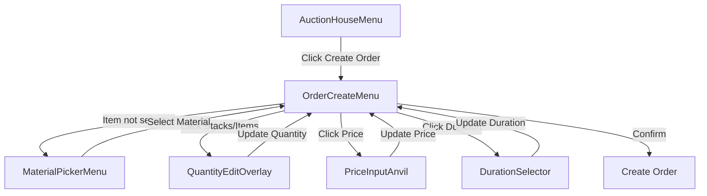

# OrderCreateMenu Design Document

## Overview

A GUI-based order creation system that handles both small quantities (36 diamond blocks) and large quantities (500 stacks = 32,000 items) with ease. Features **separate, dedicated controls for stacks and individual items**.

## Architecture



## 1. OrderCreateMenu (Main Menu) - REDESIGNED

**Layout: 6 rows with dedicated stack and item rows**

```
Row 0: [ ][ ][ ][ ][ ][ ][ ][ ][ ]
Row 1: [ ][ ][ ][I][I][I][ ][ ][ ]  <- Selected item display
Row 2: [ ][ ][ ][I][I][I][ ][ ][ ]
Row 3: [-S][Stacks][+S][ ][ ][-I][Items][+I]  <- STACKS | ITEMS split
Row 4: [ ][Price][Dur][Partial][ ][ ][ ][ ][ ]
Row 5: [Back][ ][ ][Confirm][ ][ ][ ][ ][Close]
```

### Slot Layout (Revised)

| Slot | Item | Description |
|------|------|-------------|
| 13 | Selected Material | Shows item icon + total quantity |
| **19** | **Stack--** | Red button, -1 stack (-64 items) |
| **20** | **Stacks Display** | Shows "64 Stacks" (click to edit) |
| **21** | **Stack++** | Green button, +1 stack (+64 items) |
| **25** | **Item--** | Red button, -1 item |
| **26** | **Items Display** | Shows "5 Items" (click to edit) |
| **27** | **Item++** | Green button, +1 item |
| 30 | Price Button | Price per unit with total |
| 31 | Duration | Order duration selector |
| 32 | Allow Partial | Toggle partial fills on/off |
| 40 | Confirm | Emerald block - Create order |
| 45 | Back | Return to AuctionHouseMenu |
| 53 | Close | Exit menu |

### Visual Layout Example

For an order of "64 stacks and 5 items" (4,101 total):

```
[ ][ ][ ][ ][Dirt][ ][ ][ ][ ]
[ ][ ][ ][ ][4,101 items][ ][ ][ ][ ]
[ ][ ][ ][ ][ ][ ][ ][ ][ ]
[-64][64 Stacks][+64][ ][ ][-1][5 Items][+1][ ]
[ ][ $0.05 ][ 72h ][Allow Partial][ ][ ][ ][ ][ ]
[Back][ ][ ][ Create Order ][ ][ ][ ][ ][Close]
```

### State Management

```kotlin
class OrderCreateMenu {
    private var selectedMaterial: Material? = null
    private var quantity: Int = 64  // Total items
    private var pricePerUnit: Double = 1.0
    private var duration: Duration = Duration.ofHours(72)
    private var allowPartial: Boolean = true
    private var minFillQuantity: Int? = null
    
    // Helper computed properties
    private val stacks: Int get() = quantity / 64
    private val items: Int get() = quantity % 64
}
```

### Button Details

#### Stack Controls (Slots 19-21)

**Slot 19: Stack Decrement**
- Icon: Red wool
- Name: `<red>-1 Stack`
- Lore: `<gray>Remove 64 items`
- Shift-click: Remove 10 stacks (-640 items)

**Slot 20: Stacks Display**
- Icon: Chest (or material block)
- Name: `<yellow>64 Stacks`
- Lore:
  ```
  <gray>4,096 items from stacks
  <gray>Click to set stacks directly
  ```
- Click: Open anvil input for stack count

**Slot 21: Stack Increment**
- Icon: Green wool
- Name: `<green>+1 Stack`
- Lore: `<gray>Add 64 items`
- Shift-click: Add 10 stacks (+640 items)

#### Item Controls (Slots 25-27)

**Slot 25: Item Decrement**
- Icon: Redstone
- Name: `<red>-1 Item`
- Lore: `<gray>Remove 1 item`
- Shift-click: Remove 10 items

**Slot 26: Items Display**
- Icon: Paper
- Name: `<yellow>5 Items`
- Lore:
  ```
  <gray>Individual items beyond stacks
  <gray>Click to set items directly
  ```
- Click: Open anvil input for item count (0-63)

**Slot 27: Item Increment**
- Icon: Slime ball
- Name: `<green>+1 Item`
- Lore: `<gray>Add 1 item`
- Shift-click: Add 10 items
- Auto-carry: When items reaches 64, convert to 1 stack + 0 items

#### Quick Stack Presets (Optional Row 4)

If we want quick presets, we can add them above the controls:

```
Row 3: [1s][8s][16s][32s][64s][1][8][16][32][64]  <- Presets
Row 4: [-S][Stacks][+S][ ][ ][-I][Items][+I][ ][ ]  <- Controls
```

Where:
- `1s` = 1 stack button
- `8s` = 8 stacks button
- `1` = 1 item button
- `8` = 8 items button

---

## 2. MaterialPickerMenu

**Purpose**: Select which material to order when player isn't holding the item.

**Layout: 6 rows paginated**

### Features
- **Search bar**: Click to type material name (anvil input)
- **Categories**: Building Blocks, Ores, Redstone, Food, etc.
- **Favorites**: Recently ordered items at the top
- **Popular**: Most commonly ordered items

```
[Category: All    ][Search: ______][Clear]
[ ][ ][ ][ ][ ][ ][ ][ ][ ]
[ ][Dirt][Stone][Iron][ ][ ][ ][ ][ ]
[ ][ ][ ][ ][ ][ ][ ][ ][ ]
[ ][ ][ ][ ][ ][ ][ ][ ][ ]
[< Prev ][      Page 1/10      ][ Next >]
[ ][ ][ ][ ][Back][ ][ ][ ][Close]
```

### Implementation

```kotlin
class MaterialPickerMenu(
    private val onSelect: (Material) -> Unit,
    private val allowedMaterials: List<Material> = Material.entries.filter { it.isItem }
) {
    private var searchQuery: String = ""
    private var selectedCategory: MaterialCategory = MaterialCategory.ALL
    
    fun open()
}

enum class MaterialCategory(val icon: XMaterial, val filter: (Material) -> Boolean) {
    ALL(XMaterial.CHEST, { true }),
    BUILDING(XMaterial.BRICKS, { it.isBlock && !it.isOre }),
    ORES(XMaterial.DIAMOND_ORE, { it.isOre || it.name.endsWith("_INGOT") }),
    REDSTONE(XMaterial.REDSTONE, { it.name.contains("REDSTONE") || it.name.contains("PISTON") }),
    FOOD(XMaterial.APPLE, { it.isEdible }),
    TOOLS(XMaterial.DIAMOND_PICKAXE, { it.name.endsWith("_PICKAXE") || it.name.endsWith("_AXE") }),
    COMBAT(XMaterial.DIAMOND_SWORD, { it.name.endsWith("_SWORD") || it.name.endsWith("_ARMOR") })
}
```

---

## 3. Quantity Input System - SPLIT DESIGN

**The Key Feature**: **Separate, dedicated controls for stacks and individual items**.

### Layout: Two-Column Control System

```
[ -Stack ] [ 64 Stacks  ] [ +Stack ] [ ] [ -Item ] [ 5 Items ] [ +Item ]
   Slot 19    Slot 20      Slot 21          Slot 25   Slot 26    Slot 27
```

### Stack Controls (Left Side - Slots 19-21)

**Slot 19: Stack Decrement (`-S`)**
- Icon: Red wool
- Name: `<red>-1 Stack`
- Lore:
  ```
  <gray>Remove 64 items
  <yellow>Shift-click: -10 stacks
  ```
- Click: -64 items
- Shift-click: -640 items (10 stacks)

**Slot 20: Stacks Display (`Stacks`)**
- Icon: Double chest
- Name: `<yellow>64 Stacks`
- Lore:
  ```
  <gray>4,096 items from full stacks
  <gray>Click to type exact stack count
  ```
- Click: Open anvil to set stacks directly (0-156)

**Slot 21: Stack Increment (`+S`)**
- Icon: Green wool
- Name: `<green>+1 Stack`
- Lore:
  ```
  <gray>Add 64 items
  <yellow>Shift-click: +10 stacks
  ```
- Click: +64 items
- Shift-click: +640 items (10 stacks)

### Item Controls (Right Side - Slots 25-27)

**Slot 25: Item Decrement (`-I`)**
- Icon: Redstone dust
- Name: `<red>-1 Item`
- Lore:
  ```
  <gray>Remove 1 individual item
  <yellow>Shift-click: -10 items
  ```
- Click: -1 item
- Shift-click: -10 items
- Auto-borrow: When items < 0, convert 1 stack to 64 items

**Slot 26: Items Display (`Items`)**
- Icon: Paper
- Name: `<yellow>5 Items`
- Lore:
  ```
  <gray>Individual items (0-63)
  <gray>Beyond full stacks
  <gray>Click to type exact count
  ```
- Click: Open anvil for item count (0-63)

**Slot 27: Item Increment (`+I`)**
- Icon: Slime ball
- Name: `<green>+1 Item`
- Lore:
  ```
  <gray>Add 1 individual item
  <yellow>Shift-click: +10 items
  ```
- Click: +1 item
- Shift-click: +10 items
- Auto-carry: When items >= 64, convert to 1 stack + 0 items

### Example Scenarios

#### Scenario 1: 64 stacks + 5 items (4,101 items)
```
[-64] [64 Stacks] [+64]    [ ]    [-1] [5 Items] [+1]
```

#### Scenario 2: 0 stacks + 36 items (36 items - diamond blocks)
```
[-64] [0 Stacks] [+64]     [ ]    [-1] [36 Items] [+1]
```

#### Scenario 3: 500 stacks + 0 items (32,000 items - large dirt order)
```
[-64] [500 Stacks] [+64]   [ ]    [-1] [0 Items] [+1]
```

### Auto-Carry Behavior

When items overflow or underflow:

| Action | Before | After | Result |
|--------|--------|-------|--------|
| Add 1 item | 63 items, 0 stacks | 0 items, 1 stack | Carry up |
| Remove 1 item | 0 items, 1 stack | 63 items, 0 stacks | Borrow down |
| Set 70 items | - | 6 items, 1 stack | Auto-convert |

### Direct Input via Anvil

**For Stacks (Slot 20):**
- Input: Number of stacks
- Range: 0 to 156 (10,000 / 64)
- Example: Type "115" → Sets 115 stacks = 7,360 items

**For Items (Slot 26):**
- Input: Number of items (0-63)
- Range: 0 to 63
- Example: Type "5" → Sets 5 items
- Auto-adjusts: Input "70" → Converts to 1 stack + 6 items

### Quick Presets (Optional Enhancement)

Add preset buttons in Row 3 for one-click setting:

```
Row 3:  [1s] [8s] [16s] [32s] [64s] [1] [8] [16] [32]
Row 4:  [-S] [Stacks] [+S] [ ] [ ] [-I] [Items] [+I] [ ]
```

| Preset | Sets To | For |
|--------|---------|-----|
| 1s | 1 stack (64 items) | Quick single stack |
| 8s | 8 stacks (512 items) | Small chest |
| 16s | 16 stacks (1,024 items) | Double chest |
| 32s | 32 stacks (2,048 items) | Large order |
| 64s | 64 stacks (4,096 items) | Bulk order |
| 1 | 1 item | Precise single item |
| 8 | 8 items | Small crafting batch |
| 16 | 16 items | Common crafting amount |
| 32 | 32 items | Half stack |

---

## 4. Price Configuration

### Display Format

```
Price per item: $0.05
Total order value: $368.00
Listing fee (2%): $7.36
You pay: $375.36
[Click to change price]
```

### Input Methods

1. **Anvil Input**: Type exact price per unit
2. **Quick Presets**: Common prices (0.01, 0.05, 0.10, 0.50, 1.00)
3. **Total Value Mode**: Enter total amount, auto-calculate per-unit

---

## 5. Duration & Options

### Duration Selector

**Rotating cycle:**
```
24h -> 48h -> 72h -> 168h -> 24h...
```

Click to cycle, shift+click for reverse.

### Partial Fill Toggle

```
Allow partial fills: [ON/OFF]
Minimum fill: [Click to set]
```

When ON, show minimum fill quantity selector.

---

## 6. Confirmation Display

### Final Summary (Item Lore at slot 13)

```yaml
=== Order Summary ===
Item: Dirt
Quantity: 7,360 (115 stacks)
Price: $0.05 per item
Duration: 72 hours
Allow partial: Yes

Total Cost: $368.00
+ Fee: $7.36
= You pay: $375.36

[Click Confirm to place order]
```

---

## 7. Integration Points

### Service Integration

```kotlin
// OrderCreateMenu calls:
orderService.createBuyOrder(
    creator = player,
    material = selectedMaterial,
    displayName = null,  // Future: support named items
    quantity = quantity,
    pricePerUnit = pricePerUnit,
    allowPartial = allowPartial,
    minFillQuantity = if (allowPartial) minFillQuantity else null,
    duration = duration
)
```

### MenuAPI Integration

Uses existing utilities:
- `menuAPI.simple { }` for static menus
- `menuAPI.paginated { }` for material picker
- `menuAPI.promptInt()` for numeric input
- `menuAPI.promptDouble()` for price input

---

## 8. Edge Cases

| Scenario | Handling |
|----------|----------|
| Player has insufficient funds | Show error in confirm lore, disable confirm |
| Quantity exceeds max (10,000) | Clamp to max, show warning |
| Invalid material selected | Show "Select Item" placeholder |
| Price below minimum | Show validation error |
| Shift-click quantity | Open stack-input mode directly |

---

## 9. Accessibility Features

1. **Tooltips everywhere**: Explain what each button does
2. **Visual feedback**: Items glow when configured
3. **Cancel anytime**: Back button returns to previous menu
4. **Don't reset on back**: State persists when navigating sub-menus

---

## 10. File Structure

```
AuctionHouse/src/main/kotlin/bruh/auctionhouse/gui/
├── OrderCreateMenu.kt          # Main creation menu
├── MaterialPickerMenu.kt       # Material selection
├── QuantitySelector.kt         # Quantity helper overlay
└── OrderCreateState.kt         # Data class for state
```

## Summary

This design provides:
- ✅ Easy item selection via categorized picker
- ✅ Stack-aware quantity input (type "115s" for 115 stacks)
- ✅ Visual feedback showing items + stacks
- ✅ Quick adjust buttons (+1, +10, +64, etc.)
- ✅ Clear cost breakdown before confirming
- ✅ Consistent with existing AuctionHouse GUI patterns